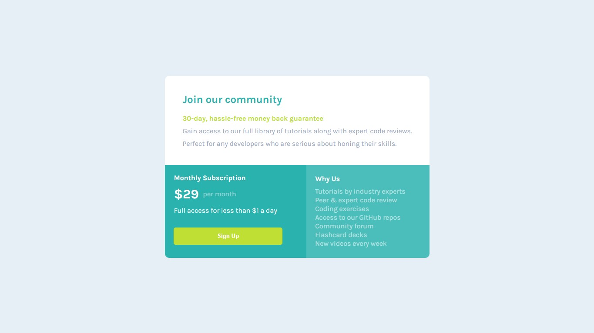

# Frontend Mentor - Single price grid component solution

Esta é uma solução para o Desafio [Single price grid component challenge on Frontend Mentor](https://www.frontendmentor.io/challenges/single-price-grid-component-5ce41129d0ff452fec5abbbc). Os desafios do Frontend Mentor ajudam você a melhorar suas habilidades de codificação criando projetos realistas. 

### 🎯 O desafio

Os usuários devem ser capazes de:

- Veja o layout ideal para o componente, dependendo do tamanho da tela do dispositivo.
- Veja um estado de foco na área de trabalho para a chamada para ação de inscrição.

### 🔗 Links 

- [Solução no Frontend Mentor](https://www.frontendmentor.io/solutions/single-price-component-with-grid-and-flex-PMZ7zlHICj)

- [Deployment no Github Pages](https://fransuelton.github.io/single-price-grid-component/)

### ✨ Tecnologias Utilziadas

- Marcação semântica HTML5
- CSS
- Flexbox
- Grid

### 📚 Aprendizado

Com esse desafio, consegui praticar o Grid no CSS, algo que confesso não ter treinado muito até agora. No entanto, acho que fiz um bom trabalho. Claro que sempre fica algo pra refatorar. Além disso, consegui firmar alguns conceitos de flexbox nesse desafio.

### 🚀 Desenvolvimento contínuo

Continuo estudando HTML e CSS para solidificar minha base, e em seguida planejo avançar para o JavaScript, que já estou estudando. Em breve, pretendo criar meu portfólio do zero usando essas ferramentas.

## 🙋 Autor

- Perfil no Linkedin - [Acesse aqui.](https://www.linkedin.com/in/fransuelton/)
- Página no Frontend Mentor - [Acesse aqui.](https://www.frontendmentor.io/profile/Fransuelton)